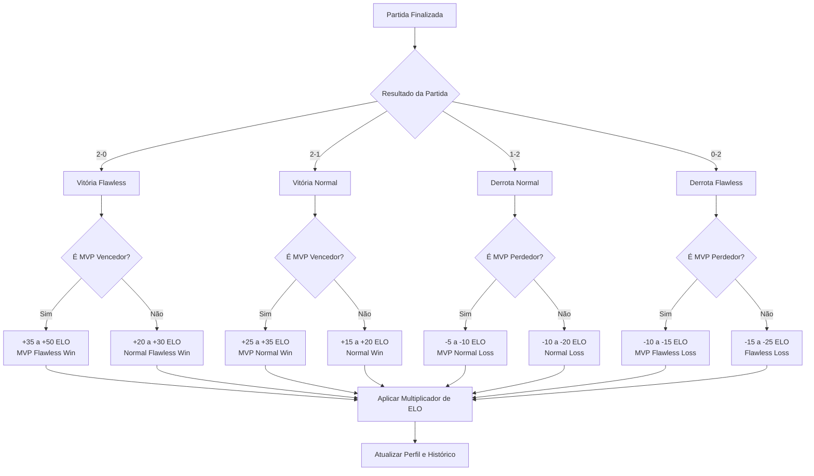

# 📊 **Sistema de ELO - Deep League Manager**

## **1. Visão Geral do Sistema**

O sistema de ELO será implementado como uma extensão do sistema atual de pontuação, permitindo que Score Operators gerenciem manualmente o ELO dos jogadores baseado na performance em partidas, com foco especial no MVP e vitórias flawless (2-0).

## **2. Sistema de Ranks**

### **2.1 Estrutura de Ranks Atualizada**

| Rank | ELO Range | Emoji | Cor |
|------|-----------|--------|-----|
| **Rank D** | 0 - 299 | <:rankD:1390356125232267294> | `#8B4513` |
| **Rank C** | 300 - 699 | <:rankC:1390356122485129308> | `#CD7F32` |
| **Rank B** | 700 - 999 | <:RankB:1390356119628677303> | `#C0C0C0` |
| **Rank A** | 1000 - 1499 | <:RankA:1390356113446142085> | `#FFD700` |
| **Rank A+** | 1500 - 1999 | <:RankAplus:1390356116071911485> | `#E5E4E2` |
| **Grandmaster** | 2000+ | <:RankG:1390356129330102375> | `#FF1493` |

## **3. Sistema de Cálculo de ELO**

### **3.1 Fórmulas de ELO Baseadas em Performance**

#### **Time Vencedor - Vitória Normal (2-1):**
- **MVP:** +25 a +35 ELO
- **Outros jogadores:** +15 a +20 ELO

#### **Time Vencedor - Vitória Flawless (2-0):**
- **MVP:** +35 a +50 ELO
- **Outros jogadores:** +20 a +30 ELO

#### **Time Perdedor - Derrota Normal (1-2):**
- **MVP:** -5 a -10 ELO (proteção por performance)
- **Outros jogadores:** -10 a -20 ELO

#### **Time Perdedor - Derrota Flawless (0-2):**
- **MVP:** -10 a -15 ELO
- **Outros jogadores:** -15 a -25 ELO

### **3.2 Fator de Ajuste baseado no ELO Atual**

```javascript
// Multiplicadores baseados no ELO atual
const ELO_MULTIPLIERS = {
    BAIXO: { min: 0, max: 699, gain: 1.2, loss: 0.8 },      // +20% ganho, -20% perda
    MEDIO: { min: 700, max: 1499, gain: 1.0, loss: 1.0 },   // Valores normais
    ALTO: { min: 1500, max: Infinity, gain: 0.8, loss: 1.2 } // -20% ganho, +20% perda
};
```

## **4. Estrutura de Dados**

### **4.1 Modificações no Perfil do Usuário**
```javascript
// Adição ao userProfileDb.js - defaultProfile
{
    bio: null,
    bannerUrl: null,
    color: null,
    achievements: [],
    guildHistory: [],
    personalScore: { wins: 0, losses: 0 },
    // NOVO: Sistema de ELO
    eloData: {
        currentElo: 700,        // ELO atual (iniciando em 700 - Rank B)
        peakElo: 700,          // Maior ELO já alcançado
        eloHistory: [],         // Histórico de mudanças
        mvpCount: 0,            // Número total de MVPs
        flawlessWins: 0,        // Número de vitórias flawless
        flawlessLosses: 0,      // Número de derrotas flawless
        lastEloUpdate: null     // Data da última atualização
    }
}
```

### **4.2 Estrutura do Histórico de ELO**
```javascript
// Cada entrada no eloHistory
{
    matchId: "thread_id_da_partida",
    date: "2025-06-30T10:00:00.000Z",
    eloChange: +35,             // Mudança no ELO
    newElo: 1035,              // ELO após a mudança
    reason: "victory_mvp_flawless", // Razões possíveis:
    // victory_mvp, victory_normal, victory_mvp_flawless, victory_normal_flawless
    // defeat_mvp, defeat_normal, defeat_mvp_flawless, defeat_normal_flawless
    matchResult: "2-0",         // Resultado da partida
    guildName: "Nome da Guilda",
    operatorId: "discord_user_id"
}
```

## **5. Fluxo de Cálculo de ELO**



## **6. Comandos a Implementar**

### **6.1 Comando Principal: `/elo-gerenciar`**
```javascript
// Comando para Score Operators
/elo-gerenciar
├── adicionar [usuário] [pontos] [razão]
├── remover [usuário] [pontos] [razão]  
├── definir [usuário] [elo_novo]
├── resetar [usuário]
├── histórico [usuário]
└── reverter [usuário] // Desfaz última mudança
```

### **6.2 Comando de Partida: `/elo-partida`**
```javascript
// Comando específico para finalizar partidas
/elo-partida finalizar
├── resultado: [2-0, 2-1, 1-2, 0-2]
├── time_vencedor: [guilda/time]
├── mvp_vencedor: [usuário]
├── time_perdedor: [guilda/time]  
├── mvp_perdedor: [usuário]
└── thread_id: [id_da_thread] (opcional)
```

### **6.3 Novos Comandos de Ranking**
```javascript
/ranking-elo [rank] // Mostra ranking por rank específico
/elo-stats [usuário] // Estatísticas detalhadas de ELO
```

## **7. Interface do Usuário**

### **7.1 Modificações no Comando `/perfil`**
```javascript
// Função para determinar rank baseado no ELO
function getEloRank(elo) {
    if (elo >= 2000) return { name: 'Grandmaster', emoji: '<:RankG:1390356129330102375>', color: '#FF1493' };
    if (elo >= 1500) return { name: 'Rank A+', emoji: '<:RankAplus:1390356116071911485>', color: '#E5E4E2' };
    if (elo >= 1000) return { name: 'Rank A', emoji: '<:RankA:1390356113446142085>', color: '#FFD700' };
    if (elo >= 700) return { name: 'Rank B', emoji: '<:RankB:1390356119628677303>', color: '#C0C0C0' };
    if (elo >= 300) return { name: 'Rank C', emoji: '<:rankC:1390356122485129308>', color: '#CD7F32' };
    return { name: 'Rank D', emoji: '<:rankD:1390356125232267294>', color: '#8B4513' };
}

// Adição de campo ELO no embed do perfil
const rank = getEloRank(userProfile.eloData.currentElo);
profileEmbed.addFields({
    name: `${rank.emoji} Sistema ELO`,
    value: `**Rank:** ${rank.name}\n**ELO Atual:** ${userProfile.eloData.currentElo}\n**Peak ELO:** ${userProfile.eloData.peakElo}\n**MVPs:** ${userProfile.eloData.mvpCount}\n**Flawless:** ${userProfile.eloData.flawlessWins}V / ${userProfile.eloData.flawlessLosses}D`,
    inline: true
});
```

## **8. Estrutura de Arquivos**

```
📁 Deep-League-Manager-main/
├── 📁 commands/
│   ├── 📄 elo-gerenciar.js (NOVO)
│   ├── 📄 elo-partida.js (NOVO)
│   ├── 📄 elo-stats.js (NOVO)
│   ├── 📄 ranking-elo.js (NOVO)
│   └── 📄 perfil.js (MODIFICAR)
├── 📁 handlers/
│   ├── 📁 db/
│   │   └── 📄 userProfileDb.js (MODIFICAR)
│   ├── 📁 elo/ (NOVO)
│   │   ├── 📄 eloCalculator.js (NOVO)
│   │   ├── 📄 eloManager.js (NOVO)
│   │   ├── 📄 eloRanks.js (NOVO)
│   │   └── 📄 eloValidation.js (NOVO)
│   └── 📁 war/core/
│       └── 📄 warLogic.js (MODIFICAR - integração opcional)
└── 📁 utils/
    └── 📄 eloConstants.js (NOVO)
```

## **9. Exemplo de Uso Prático**

### **9.1 Cenário: Partida Flawless**
```
Partida: Guilda Alpha vs Guilda Beta
Resultado: 2-0 para Alpha (Flawless)
MVP Alpha: Player1 (ELO atual: 1200)
MVP Beta: Player2 (ELO atual: 1100)

Cálculos:
- Player1 (MVP Vencedor Flawless): +42 ELO → 1242 ELO
- Outros da Alpha: +25 ELO cada
- Player2 (MVP Perdedor Flawless): -12 ELO → 1088 ELO  
- Outros da Beta: -20 ELO cada
```

### **9.2 Comando de Execução:**
```
/elo-partida finalizar
resultado: 2-0
time_vencedor: Alpha
mvp_vencedor: @Player1
time_perdedor: Beta
mvp_perdedor: @Player2
```

## **10. Funcionalidades Avançadas**

### **10.1 Sistema de Proteções**
- **ELO Mínimo:** 0 (não pode ficar negativo)
- **ELO Máximo:** 3000 (limite superior)
- **Logs Detalhados:** Todas as mudanças registradas
- **Reversão:** Última mudança pode ser desfeita
- **Sem Cooldown:** Múltiplas atualizações permitidas por dia

### **10.2 Estatísticas Especiais**
- **Taxa de MVP:** % de partidas onde foi MVP
- **Performance Flawless:** Ratio de vitórias/derrotas flawless
- **Progressão Mensal:** Gráfico de evolução do ELO
- **Comparativo de Rank:** Posição no ranking geral

## **11. Benefícios do Sistema**

1. **🏆 Reconhecimento Superior:** MVPs e vitórias flawless são recompensados adequadamente
2. **⚖️ Equilíbrio Dinâmico:** Perdedores com boa performance são menos penalizados  
3. **📈 Progressão Motivante:** Sistema de ranks claro com metas alcançáveis
4. **🎯 Competitividade:** Flawless incentiva performances dominantes
5. **🔒 Controle Total:** Score Operators mantêm controle completo
6. **📊 Métricas Completas:** Rastreamento detalhado de todas as estatísticas

## **12. Próximos Passos**

1. **Fase 1:** Implementar estrutura básica de ELO e comandos principais
2. **Fase 2:** Adicionar sistema de ranks e interface visual
3. **Fase 3:** Implementar comandos avançados e estatísticas
4. **Fase 4:** Integração com sistema de guerra existente (opcional)
5. **Fase 5:** Testes e ajustes finais baseados no feedback

---

**Sistema desenvolvido para Deep League Manager**  
*Mantendo a simplicidade e controle que você já possui, mas adicionando profundidade competitiva ao sistema de pontuação.*